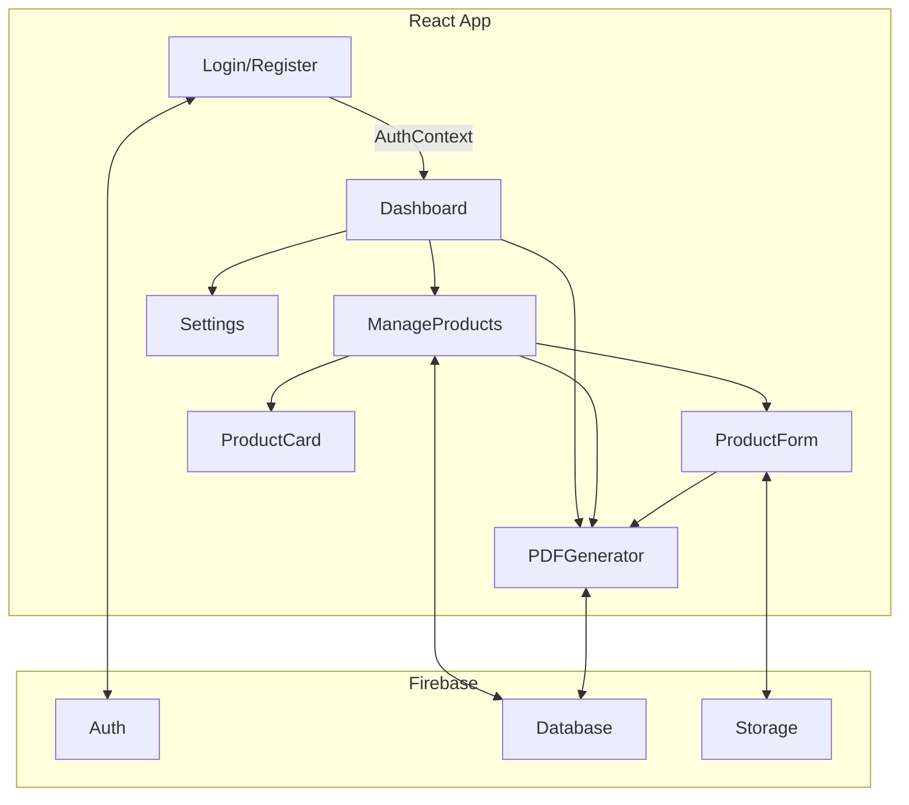
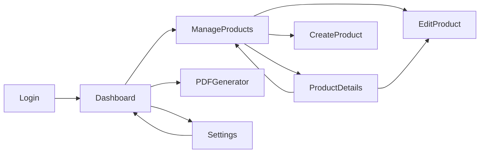

# Product Catalog Generator App

## Visão Geral

Aplicação web para cadastro, gerenciamento e geração de catálogos de produtos em PDF, com autenticação de usuários, dashboard com gráficos e interface moderna e responsiva. O sistema permite que empresas ou usuários criem, editem e organizem seus produtos, personalizem o catálogo e exportem em PDF de forma prática.

---

## Funcionalidades Principais

- Autenticação de usuários (login, registro, logout)
- Cadastro, edição, exclusão e visualização de produtos
- Upload de imagens dos produtos
- Geração de catálogo em PDF customizado
- Dashboard com gráficos e estatísticas dos produtos
- Configuração do catálogo (ex: logo)
- Busca e filtragem de produtos
- Interface responsiva e amigável

---

## Tecnologias Utilizadas

- **React** + **TypeScript**
- **Vite** (build tool)
- **Tailwind CSS** (estilização)
- **shadcn-ui** (componentes UI)
- **Firebase** (auth, database, storage)
- **React Router** (roteamento)
- **React Query** (gerenciamento de dados assíncronos)
- **Recharts** (gráficos)
- Outras libs auxiliares

---

## Estrutura de Pastas

```
src/
  components/      # Componentes reutilizáveis e de domínio (auth, layout, pdf, products, ui)
  contexts/        # Contextos globais (autenticação, produtos)
  hooks/           # Hooks customizados (responsividade, toasts)
  lib/             # Integração com Firebase e utilitários
  pages/           # Páginas principais (login, dashboard, cadastro, edição, detalhes, configurações, etc)
  types/           # Tipos TypeScript
public/            # Assets públicos (imagens, SVG, etc)
config/            # Configurações (Tailwind, Vite, etc)
```

---

## Arquitetura e Fluxos

### Diagrama de Arquitetura



### Fluxo de Navegação



---

## Componentes e Contextos Principais

- **AuthContext:** Gerencia autenticação, login, logout, estado do usuário.
- **ProductContext:** Gerencia produtos (CRUD), upload de imagens, configuração do catálogo.
- **MainLayout:** Estrutura principal da aplicação (header, navegação, footer).
- **PDFGenerator:** Geração e visualização de catálogo em PDF.
- **ProductCard/ProductForm:** Exibição e cadastro/edição de produtos.
- **Hooks:** useIsMobile (responsividade), useToast (notificações).

---

## Integração com Firebase

- **Auth:** Autenticação de usuários.
- **Database:** Armazenamento dos dados dos produtos e configurações.
- **Storage:** Upload e armazenamento de imagens dos produtos.

---

## Instruções de Instalação, Execução e Deploy

```sh
# Clonar o repositório
git clone <YOUR_GIT_URL>
cd <YOUR_PROJECT_NAME>

# Instalar dependências
npm install

# Executar em modo desenvolvimento
npm run dev

# Build para produção
npm run build

# Deploy via Lovable ou Vercel/Netlify (ajustar conforme necessidade)
```

---

## Exemplos de Uso

- **Cadastro de Produto:** Acesse "Gerenciar Produtos" > "Cadastrar Produto", preencha os campos e salve.
- **Edição/Exclusão:** Em "Gerenciar Produtos", clique em "Editar" ou "Excluir" no produto desejado.
- **Geração de PDF:** No Dashboard, clique em "Gerar Catálogo PDF" para visualizar e baixar o catálogo.
- **Configuração:** Em "Configurações", altere o logo e outras opções do catálogo.

---

## Observações Finais

- O projeto é facilmente extensível para novas funcionalidades.
- O código segue boas práticas de organização, tipagem e reutilização.
- Recomenda-se configurar as variáveis do Firebase em um arquivo `.env.local`.

---